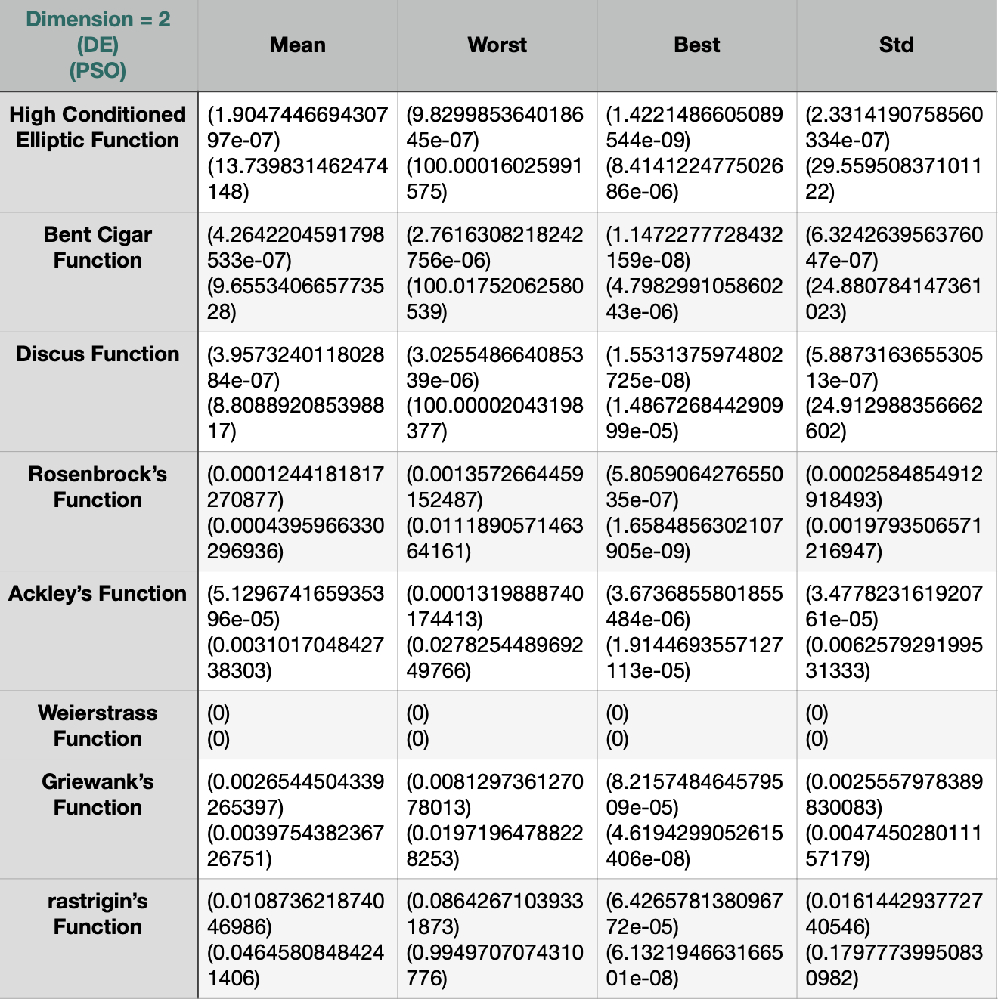

optimization

This repository contains implementations of Differential Evolution (DE) and Particle Swarm Optimization (PSO) algorithms applied to 8 benchmark optimization functions:

- High Conditioned Elliptic Function
- Bent Cigar Function
- Discus Function
- Rosenbrock’s Function
- Ackley’s Function
- Weierstrass Function
- Griewank’s Function
- Rastrigin’s Function

These functions are widely used to evaluate the performance of optimization algorithms in various research and applications.

## Comparison of DE and PSO Algorithms

Below is a comparison of the DE and PSO algorithms across the benchmark functions:

